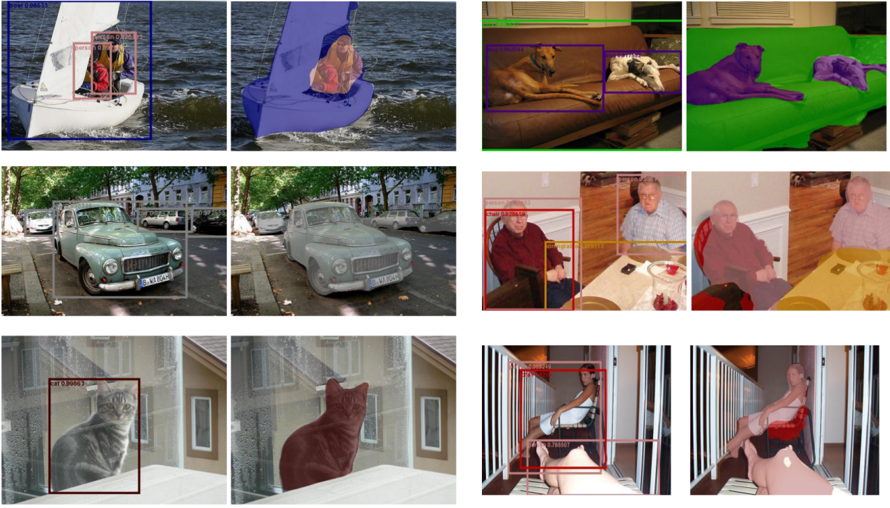

# BlitzNet: A Real-Time Deep Network for Scene Understanding

 Deep neural network for object detection and semantic segmentation in real-time.

## Introduction
This repository contains original implementation of the paper 'BlitzNet: A Real-Time Deep Network for Scene Understanding' by Nikita Dvornik, Konstantin Shmelkov, Julien Mairal and Cordelia Schmid.
The paper is available at https://arxiv.org/abs/1708.02813

The page of the paper is http://thoth.inrialpes.fr/research/blitznet/



## Citing
Please cite BlitzNet in your publications if it helps your research:

    @inproceedings{dvornik2017blitznet,
      title = {{BlitzNet}: A Real-Time Deep Network for Scene Understanding},
      author = {Dvornik, Nikita and Shmelkov, Konstantin and Mairal, Julien and Schmid, Cordelia},
      booktitle = {{IEEE International Conference on Computer Vision (ICCV)}},
      year = {2017}
    }

## Requirements
* Python 3.5
* Tensorflow >=1.2
* Numpy 1.13
* Matplotlib 2.0.0
* OpenCV 3.2
* PIL 4.0
* glob
* tabulate
* progressbar

## Datasets
In this work we used the Pascal VOC07, VOC12 and the Microsoft COCO datasets. For the experiments with Pascal VOC datasets we also leveraged extra segmentation annotation provided by B. Hariharan et al. available [here](http://home.bharathh.info/pubs/codes/SBD/download.html).

## Instalation
Clone this git repository
```sh
git clone https://github.com/dvornikita/blitznet.git
```
and install all the requirements listed above.

## Preparation
1. Enter the directory of the project and set the paths to your directories in the file `paths.py`.
2. Download VOC2007 and VOC2012 dataset. By default, we assume the data is stored in `$HOME/Datasets/`.
    ```sh
    # Download the data.
    cd $HOME/Datasets
    wget http://host.robots.ox.ac.uk/pascal/VOC/voc2012/VOCtrainval_11-May-2012.tar
    wget http://host.robots.ox.ac.uk/pascal/VOC/voc2007/VOCtrainval_06-Nov-2007.tar
    wget http://host.robots.ox.ac.uk/pascal/VOC/voc2007/VOCtest_06-Nov-2007.tar
    # Extract the data.
    tar -xvf VOCtrainval_11-May-2012.tar
    tar -xvf VOCtrainval_06-Nov-2007.tar
    tar -xvf VOCtest_06-Nov-2007.tar
    ```
3. If you would like to use extra annotations for segmentation provided by B. Hariharan et al., run `set_extra_annotations.py`. If you want a model with better performance this step is recommended.
4. If you would like to train on COCO, visit http://mscoco.org/ for more information. You will need to install [pycocotools](https://github.com/pdollar/coco) and place a dataset in the `$HOME/Datasets/`.
5. We encode training data into a protobuf file to efficiently load the data during training. For this, you need to open the file `datasets.py` and uncomment needed dataset in the body of 'main' function. Then run the `datasets.py`. The dataset will be saved in `$HOME/Datasets/`.

## Running a demo with pretrained net

1. After you downloaded the models run (given you want to suppress all the detections with confidence less then 0.5) 

    ```sh
    python demo.py --run_name=BlitzNet300_COCO+VOC07+12 --x4 --detect --segment --eval_min_conf=0.5 --ckpt=1
    ```
2. Check the output in `$HOME/Demo/output`.

## Running BlitzNet with user interface (NEW)
 1. Go to the folder `$HOME/interface` and run demo.sh script. It will
    initialize the network and run the user interface where you can upload your
    images and apply the algorithm to them.
 2. The button `Browse` opens file dialog and allows to select an image on the
    hard drive to operate on. To change the initial directory for browsing
    modify the variable init_path in `$HOME/interface/main.py`

    The button `From Clipboard` allows to grab the link to an image (in WEB) from
    your clipboard (of course, you need to copy the link before) and to download it
    automatically. To change a folder where the images are saved modify the
    variable DOWNLOAD_ROOT in `$HOME/interface/demo_utils.py`.

    After you chose an image using either way, the image will be displayed in
    the application's window.
 3. To process an image with the algorithm press `Run BlitzNet` and in an
    instance estimated bounding boxes and segmentation maps will be put on an
    image and displayed for you.
 4. Press `View Classes` to see what categories the detector is trained on and
    thus what it can detect.

## Training a model with ImageNet initialization
1. Download the weights for [ResNet50](https://drive.google.com/open?id=0B7XqhdpFpfcIdWRTX1JSOEhubXM) or [VGG16](https://drive.google.com/open?id=0B7XqhdpFpfcITnk4X1p3ZDRqQmc) and unpack the archives to `$HOME/Weights_imagenet`. You can change this folder in `paths.py`. Note that we build our work based on the ResNet architecture so we recommend to use it in your experiments.
2. To start training a model with ResNet50 backbone on VOC07+12 data (including extra annotations for segmentation) that operates on images of size 300x300 - a batch of 32 - and has a final layer of stride 4 to perform joint detection and segmentation with optimization strategy as in the original paper, you need to run the following command:
    ```sh
    python training.py --run_name=BlitzNet300_x4_VOC0712_detseg --dataset=voc07+12-segmentation --trunk=resnet50 --x4 --batch_size=32 --optimizer=adam --detect --segment --max_iterations=65000 --lr_decay 40000 50000
    ```
    Here, `--run_name` is a required argument that specifies the name of the experiment (needed to restore the weights later in testing and to visualize statistics in Tensorboard), `--dataset` specifies the name of the dataset you want to train on. See the relation between this name and the protobuf dataset files in the 'main' function of training.py. For more information about flags and running options read `config.py`.
    During the training you checkpoints will be automatically saved every 1000 iterations in $HOME/archive/BlitzNet300_x4_VOC0712_detseg/ and all the training statistics will be dumped to Tensorboard every 100 iterations.
3.  To train on a particular split of VOC12 please specify the flag --dataset=voc12-splitname, where splitname is in [train, val, trainval]. Training on VOC07 operates on both train and val splits by default and is called with a flag --dataset=VOC07.

## Testing a model
1. If your model was successfully trained and you want to evaluate the performance of a particular checkpoint (let's say 65000 - the last one) on VOC07 test and you want visualization of estimated bounding boxes for the first 100 images in the list , you need to run
    ```sh
    python test.py --run_name=BlitzNet300_x4_VOC0712_detseg --dataset=voc07 --split=test --image_size=300 --x4 --detect --segment --ckpt=65 --save_first_n=100
    ```
    For testing, we don't use protobuf dataset files but rather evaluate one image at a time loading it with corresponding groundtruth on-the-fly. That is why now in `--dataset` and `--split` you need to specify literally the dataset and split you want to evaluate on.
    If the dataset (VOC07 in this case, but not VOC12) has no segmentation annotations but you turn on the flag `--segment` during the evaluation, it will build a graph with the corresponding branch and estimate the segmentation masks but the final mean IoU that BlitzNet outputs on this dataset after evaluation is meaningless.
2. If you trained a model and you want to evaluate all/some checkpoints automatically, run this:
    ```sh
    python test.py --run_name=BlitzNet300_x4_VOC0712_detseg --dataset=voc07 --split=test --x4 --detect --segment --batch_eval --min_ckpt=10 --step=2
    ```
    This command will evaluate all the checkpoints available for BlitzNet300_x4_VOC0712_detseg experiment starting from checkpoint at 10000 iterations with a step of 2000 steps. The flag `--batch_eval` turns on consequtive evaluation, the flag `--min_ckpt` defines the first checkpoint to evaluate and `--step` sets the step between evaluated checkpoints, all in thousands. This will create a file `$HOME/archive/BlitzNet300_x4_VOC0712_detseg/1evaluations.txt` with score summaries for each evaluated checkpoint.
3. If you want to evaluate the model already trained by us, download the following checkpoints from the table, then unpack an archive to the folder `$HOME/archive`.

    |             | VOC07+12          | COCO+VOC07+12     | COCO              |
    | :---         |     :---:      |          :---: | :---: |
    | BlitzNet300* | [:arrow_down:](https://drive.google.com/open?id=0B7XqhdpFpfcIcTNtVU9VeHRLcG8) | [:arrow_down:](https://drive.google.com/open?id=0B7XqhdpFpfcIV2hqOWswU01zdlU) | [:arrow_down:](https://drive.google.com/open?id=0B7XqhdpFpfcIN2tSOEJ4d2FmVTg) |
    | BlitzNet512** | [:arrow_down:](https://drive.google.com/open?id=0B7XqhdpFpfcIYmtkYTlSalBtaUk) | [:arrow_down:](https://drive.google.com/open?id=0B7XqhdpFpfcIdGVjN2c5dUlvWEU) | [:arrow_down:](https://drive.google.com/open?id=0B7XqhdpFpfcIU3U1U3poaDdwME0) |

    *For all datasets, architectures include the final layer of stride 4, so activate flag `--x4` as test time.

    **For all datasets, architectures do not include the final layer of stride 4 because it didn't fit into the gpu memory.

    To test a model BlitzNet512 trained on COCO+VOC07+12 run:
    ```sh
    python test.py --run_name=BlitzNet512_COCO+VOC07+12 --dataset=voc07 --split=test --image_size=512 --detect --segment --ckpt=1
    ```
    To simplify the running process we associated all the checkpoints with the epoch 1000 so, for all the models, you need to specify `--ckpt=1` when testing.
    
    __NOTE__: When generating detections on first N images (```--save_first_n=N```), to filter bounding boxes  with low score leaving only the confident ones, specify an extra flag defining the confidence threshold, let's say of 0.5: ```--eval_min_conf=0.5```. 
